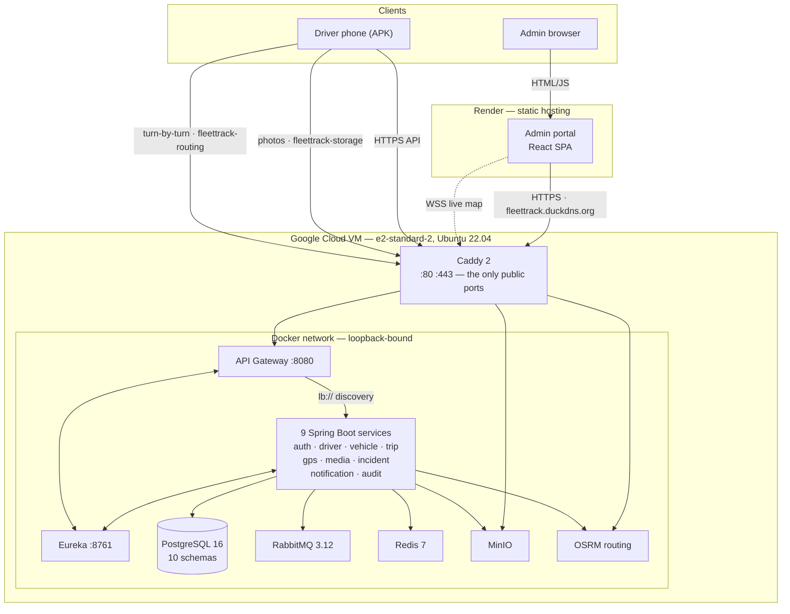

# FleetSync Pro — Deployment Guide

**What is deployed, where it lives, and how it gets there.**

This is the reference companion to [`DEPLOYMENT.md`](../DEPLOYMENT.md) at the repo root. That
file is the *do-this-in-order* setup script for a fresh environment. This one explains the
**shape** of the deployment — every host, every container, every environment variable, and
why each piece sits where it does.

Repository: `https://github.com/princequid/FleetTracking`
Default branch: `main`

---

## 1. The three deployment targets

The system is not one deployable. It is three, with different lifecycles, different hosting,
and different release cadences.

| # | Piece | What it is | Hosted on | How it ships |
|---|---|---|---|---|
| 1 | **Backend** | 11 Java containers + 5 infrastructure containers + TLS proxy | **One Google Cloud VM**, Docker Compose | SSH → `git pull` → `docker compose up -d --build` |
| 2 | **Admin portal** | Static React SPA (Vite build output) | **Render** static hosting | Auto-deploys on push to `main` |
| 3 | **Driver app** | React Native / Expo, Android APK | **Expo EAS** build servers → APK on device | `eas build -p android --profile preview` |

**Why a single VM and not managed services.** Eleven Spring Boot services on a managed
container platform means eleven billable units plus a managed Postgres, a managed broker,
and a managed object store. On one VM they are eleven processes sharing a Docker network,
and the whole thing costs one VM. The trade is honest: there is no autoscaling and no
built-in redundancy — this box is a single point of failure. For a fleet-management pilot
that is the right trade; for multi-tenant production it would not be.

**Why the frontend is not on the VM.** The admin portal is static files after `npm run
build`. Serving them from the VM would spend VM memory and add a Caddy route for something
a CDN does better and free. Render also gives push-to-deploy for nothing.

**Why the mobile app builds on EAS.** Android release builds need a signing keystore and an
Android SDK toolchain. EAS holds the keystore and runs the toolchain, so the APK is
reproducible from any machine without a local Android setup.

---

## 2. Topology



The important structural fact: **Caddy is the only thing the internet can reach.** Everything
else is bound to `127.0.0.1` on the VM (via `HOST_BIND`) or not published to the host at all.

---

## 3. Backend — the Google Cloud VM

### 3.1 The machine

| Setting | Value | Why |
|---|---|---|
| Machine type | `e2-standard-2` — 2 vCPU, 8 GB RAM | 11 JVMs + Postgres + OSRM. `e2-micro` (1 GB, the always-free tier) cannot run this. |
| OS | Ubuntu 22.04 LTS | |
| Disk | 30 GB standard | Docker images (~4 GB) + Postgres + MinIO + the OSRM graph (~1 GB). |
| Open ports | 22, 80, 443 only | Everything else is loopback-bound. |
| Billing | $300 / 90-day GCP trial credit | ~$50/mo on-demand after the trial. Budget for it or downsize before it expires. |

### 3.2 Container inventory — what actually runs

Seventeen containers in production. Compose file: `infrastructure_1/docker-compose.yml`
plus the `docker-compose.prod.yml` overlay.

**Infrastructure (5)**

| Container | Image | Internal port | Memory cap | Persistent volume |
|---|---|---|---|---|
| `postgres` | `postgres:16-alpine` | 5432 (host 5433) | 2 GB | `postgres-data` |
| `rabbitmq` | `rabbitmq:3.12-management-alpine` | 5672, 15672 | 256 MB | `rabbitmq-data` |
| `redis` | `redis:7-alpine` | 6379 | 320 MB | none (cache only) |
| `minio` | `minio/minio` | 9000, 9001 | 128 MB | `minio-data` |
| `osrm` | `osrm/osrm-backend` | 5000 | 1 GB | bind mount `./osrm-data` |

**Platform (3)**

| Container | Port | Memory cap | Role |
|---|---|---|---|
| `eureka-server` | 8761 | 384 MB | Service registry. Everything registers here; the gateway resolves `lb://` names from it. |
| `api-gateway` | 8080 | 384 MB | Single entrypoint. Validates the JWT, stamps `X-User-Id` / `X-User-Role` / `X-Internal-Service-Key`, routes by path. |
| `caddy` | 80, 443 | — | TLS termination, automatic Let's Encrypt. **Production only** — the overlay disables the dev `reverse-proxy` (nginx + self-signed) via a `dev-only` profile. |

**Business services (9)** — all `expose`d only, never published to the host, so nothing can
bypass the gateway's JWT check by hitting a service directly.

| Container | Port | Heap cap | Owns | Reached via |
|---|---|---|---|---|
| `auth-service` | 8081 | 384m | Login, JWT issue/refresh, password reset, staff accounts | `/auth/**` |
| `driver-service` | 8082 | 384m | Driver profiles, licences, availability | `/drivers/**` |
| `vehicle-service` | 8083 | 384m | Fleet, vehicle status lifecycle | `/vehicles/**` |
| `trip-service` | 8084 | 384m | Trip lifecycle, stops, ETAs, POD checks | `/trips/**` |
| `gps-service` | 8085 | 384m | Location ingest, live-map STOMP socket, geofencing | `/gps/**`, `/ws/**` |
| `media-service` | 8086 | 384m | Presigned photo upload/download against MinIO | `/media/**` |
| `incident-service` | 8087 | 384m | Incident reports, severity, alerting | `/incidents/**` |
| `notification-service` | 8088 | 384m | Email (Gmail SMTP), optional FCM push | `/notifications/**` |
| `audit-service` | 8090 | 384m | Immutable audit trail | **No gateway route** — event-driven only, consumes from RabbitMQ |

> `analytics-service_5` is **intentionally not deployed**. It is an unimplemented stub with no
> `pom.xml` and no main class. Its database schema exists; nothing writes to it.

### 3.3 A note on the memory budget

The `deploy.resources.limits` sum to roughly 9.2 GB on an 8 GB VM. That is deliberate and not
a bug: Compose limits are **caps, not reservations** — nothing is pre-allocated. The real
control is the JVM heap ceiling set per service through `JAVA_TOOL_OPTIONS`
(`-Xmx384m` for business services, `-Xmx256m` for Eureka and the gateway), which bounds actual
usage well below the container caps.

Two of those caps were raised after real OOM kills and the reasoning is worth keeping:

- **Postgres was 256 MB.** That is below Postgres 16's own defaults — `shared_buffers` alone
  is 128 MB — while ~55 pooled connections pointed at it. The kernel OOM-killed it
  mid-transaction, and `restart: unless-stopped` then masked the crash as a transient blip.
- **Redis ran on stock defaults** with no `maxmemory`, so it never evicted; it simply grew to
  the cgroup limit and was killed, taking live tracking down with it. It now has
  `maxmemory 200mb` with `allkeys-lru`, and a 320 MB cap *above* that — so Redis evicts by its
  own policy rather than being killed by the kernel's.

`JAVA_TOOL_OPTIONS` is also load-bearing: an earlier `JAVA_OPTS` was silently a no-op, because
the Dockerfile's exec-form `ENTRYPOINT` never expanded it. The JVM reads `JAVA_TOOL_OPTIONS`
from the environment directly.

### 3.4 Networking, DNS and TLS

Three DuckDNS hostnames, all pointing at the same VM external IP:

| Hostname | Proxies to | Why it needs its own name |
|---|---|---|
| `fleettrack.duckdns.org` | `api-gateway:8080` | The public API and the live-map websocket. |
| `fleettrack-storage.duckdns.org` | `minio:9000` | MinIO signs presigned URLs **against its own hostname**. Behind a path prefix the signatures fail to validate, so it needs a clean host. |
| `fleettrack-routing.duckdns.org` | `osrm:5000` | The driver app calls OSRM **directly** for turn-by-turn and rerouting, bypassing the gateway entirely. |

Caddy obtains and renews Let's Encrypt certificates automatically, provided all three names
resolve to the VM and ports 80/443 are open. Config: `infrastructure_1/Caddyfile`.

**Why loopback binding matters more than the firewall.** Docker's port publishing installs
DNAT rules that bypass host `iptables`. A GCP firewall rule alone would not necessarily
protect an unauthenticated Redis or the Eureka dashboard. Setting `HOST_BIND=127.0.0.1` binds
those published ports to loopback, which is what actually closes them. **This is required in
production.**

### 3.5 Data layer

One PostgreSQL 16 instance, **schema-per-service** — ten schemas, created on first boot by
`infrastructure_1/db/init/01_create_databases.sql`:

```
fleettrack_auth   driver   vehicle   trip   gps
media   incident   notif   audit   analytics
```

Each service owns its schema and reaches the others only over HTTP through the gateway or by
consuming events. There are no cross-schema foreign keys — that is what makes the split into
separate databases possible later without a rewrite.

Migrations run through **Flyway**, automatically on each service's startup. A deploy that
includes a migration applies it when the container boots; no manual step.

| Volume | Holds | Loss impact |
|---|---|---|
| `postgres-data` | All application data | Total |
| `minio-data` | Delivery photos, POD images | Total for evidence |
| `rabbitmq-data` | Durable queue state (mnesia) | Undelivered events |
| `caddy_data` | TLS certificates | Re-issued automatically |
| `./osrm-data` | Routing graph (bind mount) | Rebuildable in minutes |

`rabbitmq-data` is persisted deliberately. Services declare **durable** queues with
dead-letter queues, and durability is meaningless without storage. Re-declaring a queue on
startup restores the *queue*, not the *messages in it* — so every restart silently discarded
undelivered audit and incident-alert events, with no error surfaced anywhere. The container
also pins `RABBITMQ_NODENAME` and `hostname`, because without a stable node name the mnesia
directory is orphaned on every recreate and the volume achieves nothing.

### 3.6 Complete environment variable reference

Lives at `infrastructure_1/.env` **on the VM only**. Gitignored — never committed.

Variables marked **required** use Compose's `:?` fail-fast syntax: if unset, `docker compose
up` refuses to start rather than booting a service with a blank password.

**Secrets — generate fresh on the server**

| Variable | Required | Notes |
|---|---|---|
| `POSTGRES_PASSWORD` | ✅ | `openssl rand -hex 20` |
| `RABBITMQ_PASSWORD` | ✅ | `openssl rand -hex 20` |
| `REDIS_PASSWORD` | ✅ | `openssl rand -hex 20` — **see §8, this is missing from the root DEPLOYMENT.md template** |
| `MINIO_ROOT_PASSWORD` | ✅ | `openssl rand -hex 20`. Compose hands this to media-service as its MinIO secret key automatically, so they cannot drift. |
| `JWT_SECRET` | ✅ | `openssl rand -hex 48`. Shared by auth-service (signs) and the gateway (verifies). |
| `INTERNAL_SERVICE_SECRET` | ✅ | `openssl rand -hex 32`. Marks service-to-service calls. |
| `POSTGRES_USER` / `RABBITMQ_USER` / `MINIO_ROOT_USER` | default `fleettrack` | |
| `POSTGRES_DB` | default `fleettrack` | |

**Domains**

| Variable | Example |
|---|---|
| `API_DOMAIN` | `fleettrack.duckdns.org` |
| `STORAGE_DOMAIN` | `fleettrack-storage.duckdns.org` |
| `OSRM_DOMAIN` | `fleettrack-routing.duckdns.org` |
| `ACME_EMAIL` | Let's Encrypt contact address |
| `MINIO_EXTERNAL_ENDPOINT` | `https://fleettrack-storage.duckdns.org` — baked into presigned URLs, so it must be the **public** host. The phone opens these URLs, not the server. |

**Application wiring**

| Variable | Purpose |
|---|---|
| `CORS_ALLOWED_ORIGINS` | The Render admin URL. Drives **both** gateway CORS and the gps-service STOMP socket's allowed origins. Wrong here and the live map's handshake is rejected. |
| `FRONTEND_URL` | Base URL in password-reset emails. |
| `ADMIN_PORTAL_URL` | Base URL for "View incident" / "View dashboard" email links. |
| `HOST_BIND` | **Set to `127.0.0.1` in production.** See §3.4. |
| `INITIAL_ADMIN_EMAIL` / `INITIAL_ADMIN_PASSWORD` | Creates the first SUPER_ADMIN on auth-service's first boot, only if no admin exists. Blank disables it. |
| `GMAIL_USERNAME` / `GMAIL_APP_PASSWORD` | Gmail SMTP. **Both blank disables email sending entirely** — services log a warning and skip; nothing breaks. The app password comes from a Google account with 2-Step Verification enabled, not the normal password. |

Internal wiring set by Compose, not by you: `SPRING_DATASOURCE_*`, `SPRING_RABBITMQ_*`,
`SPRING_DATA_REDIS_*`, `EUREKA_CLIENT_SERVICEURL_DEFAULTZONE`, `OSRM_BASE_URL`.

> `OSRM_BASE_URL: http://osrm:5000` on trip-service is not optional. The application default
> is `localhost:5000`, which inside a container means *that container* — OSRM calls would fail
> with connection-refused and both driver navigation and admin ETAs would break silently.

**Eureka timing.** Every service overrides the registry intervals to 5–10 s (defaults are
~30–40 s). This is pure timing and changes no behaviour, but it closes the window where a
freshly-booted service is invisible to the gateway. The gateway's own
`REGISTRYFETCHINTERVALSECONDS: 5` is the single biggest lever on "the service is up but the
gateway still 503s it."

---

## 4. Admin portal — Render

| Setting | Value |
|---|---|
| Service type | Static Site |
| Root directory | `admin-portal_4` |
| Build command | `npm ci && npm run build` |
| Publish directory | `dist` |
| Environment | `VITE_API_BASE_URL = https://fleettrack.duckdns.org` |
| Rewrite rule | `/*` → `/index.html` (**Rewrite**, not Redirect) |
| Trigger | Auto-deploys on push to `main` |

The rewrite rule is what makes client-side routing work. Without it, a hard refresh on
`/trips` asks Render for a file at that path, gets a 404, and the app appears broken on every
route except `/`.

**The circular setup step.** The portal needs the API URL, and the API needs the portal's
origin for CORS. Deploy Render first, take the assigned URL, then go back to the VM `.env`,
set `CORS_ALLOWED_ORIGINS` / `FRONTEND_URL` / `ADMIN_PORTAL_URL` to it, and re-run the compose
command.

`VITE_` variables are **baked in at build time**, not read at runtime. Changing the API URL
requires a rebuild, not a restart.

---

## 5. Driver app — Expo EAS

Package: `com.fleettrack.mobile`. Build profiles in `mobile/eas.json`.

| Profile | Output | Use |
|---|---|---|
| `development` | Dev client | Local development against the deployed API |
| `preview` | **APK** | What you install on phones and demo |
| `production` | AAB (app bundle) | Play Store submission |

```bash
cd fleettrack-pro/mobile
npm i -g eas-cli
eas login
eas build -p android --profile preview
```

Download the APK from the link EAS prints and install it.

**Google Maps key is required.** Without it the driver map renders blank grey on a release
build. Enable "Maps SDK for Android", create an API key restricted to package
`com.fleettrack.mobile`, and set it in `mobile/app.json`. A Maps *Android* key is a client key
restricted by package and signing signature — it is safe to ship in the app and is not a
server secret.

iOS needs a paid Apple Developer account. The Android APK is the free path.

Push notifications are **off by default** and the app runs fine without them. Admin in-app
notifications (the bell polls incidents and trip events) and driver alert polling both work
without FCM. Real background push additionally needs a Firebase service-account JSON on the
VM and a matching `google-services.json` in `mobile/`.

---

## 6. CI/CD

Two workflows in `.github/workflows/`.

**`test-and-build.yml`** — runs on every push and pull request:

| Job | Does |
|---|---|
| `backend` | Matrix across services: JDK 17, install `shared-events`, `mvn test` + build |
| `admin-portal` | `npm ci` + production build |
| `audit` | `npm audit` on portal and mobile |
| `secrets` | gitleaks secret scan |

**`deploy-v1.yml`** — **manual trigger only** (`workflow_dispatch`), behind a `production`
GitHub Environment so a reviewer can be required. It SSHes to the VM and runs the same
compose command a human would.

This is deliberately not automatic. An accidental push must never reach production. A
`concurrency` group also prevents two deploys racing against the same box.

Required repository secrets: `DEPLOY_HOST`, `DEPLOY_USER`, `DEPLOY_SSH_KEY`, `DEPLOY_PATH`.
Until they exist the workflow fails fast at its preflight step, by design.

---

## 7. Runbook

### Deploying a backend change

```bash
ssh <user>@<vm-ip>
cd ~/fleettrack
git pull origin main
cd infrastructure_1

# Rebuild only what changed — everything else keeps running:
docker compose -f docker-compose.yml -f docker-compose.prod.yml \
  up -d --build vehicle-service trip-service

# Or the whole stack:
docker compose -f docker-compose.yml -f docker-compose.prod.yml up -d --build
```

Flyway migrations apply automatically as each container boots.

### Verifying a deploy actually landed

Do this deliberately. A rebuilt image with a fresh timestamp is **not** proof the new code is
running — that assumption has cost real debugging time on this project. Check behaviour:

```bash
docker compose ps                      # everything Up, nothing restart-looping
docker compose logs -f <service>       # watch for the behaviour you changed
docker compose images <service>        # image build time
```

Health checks from anywhere:

```bash
# 400 = healthy (bad credentials reached auth-service). 502/timeout = not ready.
curl -s -o /dev/null -w "%{http_code}\n" https://fleettrack.duckdns.org/auth/login \
  -X POST -H "Content-Type: application/json" -d '{"email":"x@x.com","password":"y"}'

# 200 = OSRM serving routes.
curl -s -o /dev/null -w "%{http_code}\n" \
  "https://fleettrack-routing.duckdns.org/route/v1/driving/-0.186964,5.603717;-0.196964,5.613717?overview=false"
```

A 502 on the OSRM check usually means `osrm-data` was never generated — that folder is
gitignored and is **not** in the clone. Without it the OSRM container crash-loops and all
routing is dead even though the rest of the stack comes up fine. Confirm with
`docker compose ps osrm`; it should say "Up", not a restart loop.

### Common operations

```bash
docker compose logs -f --tail=100 trip-service     # tail one service
docker compose restart gps-service                 # restart without rebuild
docker compose exec postgres psql -U fleettrack -d fleettrack   # database shell
docker stats --no-stream                           # memory pressure check
```

### Manual database backup

There is no automated backup (see §8). Until there is:

```bash
docker compose exec -T postgres pg_dump -U fleettrack fleettrack | gzip > backup-$(date +%F).sql.gz
```

---

## 8. Known gaps

Stated plainly, because a deployment doc that hides its gaps is worse than none.

**1. `REDIS_PASSWORD` is missing from the root `DEPLOYMENT.md` `.env` template.**
`docker-compose.yml` declares `${REDIS_PASSWORD:?REDIS_PASSWORD must be set}`, so following
that template verbatim produces a stack that **refuses to start**. Add it:

```bash
echo "REDIS_PASSWORD=$(openssl rand -hex 20)" >> .env
```

**2. `EXPO_PUBLIC_OSRM_URL` is not set in any `eas.json` build profile.**
The profiles set `EXPO_PUBLIC_API_URL` only. `mobile/app/(driver)/trip/[id]/map.jsx:41` falls
back to `https://router.project-osrm.org` — OSRM's rate-limited public demo server — when the
variable is absent. The root `DEPLOYMENT.md` says to write it into `mobile/.env`, but that
file is gitignored and so is not uploaded to EAS's build servers. The result is an APK whose
routing works sometimes and then mysteriously stops, with no error shown. Fix by adding it to
each profile's `env` block in `eas.json` alongside `EXPO_PUBLIC_API_URL`.

**3. No automated backups.** RPO and RTO are both unbounded. If the VM's disk fails, all trip
history, all delivery photos and all audit records are gone. `pg_dump` plus a MinIO mirror to
Cloud Storage on a cron is the smallest thing that fixes this.

**4. Secrets need rotating.** `JWT_SECRET` and the Google Maps key are present in git history.
Rotating the secrets is quick; purging the Maps key from history is what currently keeps the
CI secret scan red.

**5. Single point of failure.** One VM, one Postgres, no replica, no failover. Acceptable for
a pilot; not for production traffic.

**6. Scheduled jobs are not distributed-locked.** trip-service's vehicle reconciliation sweep
uses plain `@Scheduled`. Harmless at one replica, and harmless even if double-fired because
the release is idempotent — but the same pattern on the outbox publisher would double-publish
events. Add ShedLock before scaling any service past one replica.

**7. No observability stack.** No metrics, no structured logs, no alerting. Diagnosis today is
`docker compose logs`. Actuator + Micrometer + Prometheus is the standard next step.

---

## 9. Cost

| Item | Cost |
|---|---|
| Google Cloud `e2-standard-2` | Free during the $300 / 90-day trial, then ~$50/mo on-demand |
| Render static site | Free |
| DuckDNS (3 hostnames) | Free |
| Expo EAS | Free tier |
| Let's Encrypt certificates | Free |
| **Total during trial** | **$0** |

The trial expiry is the thing to diary. When it ends, either downsize the VM, move to a
cheaper provider, or accept the monthly cost.
